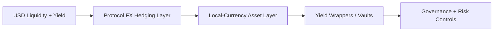

# TL;DR - Quantillon in 5 Minutes

> **One-liner:** Quantillon lets users access USD-denominated DeFi liquidity and yield without staying exposed to the dollar.

---

## The 30-Second Version

- **Quantillon** = the protocol layer for FX-hedged local-currency DeFi
- **QEURO** = the first deployment of that protocol for EUR exposure
- **stQEURO** = the first deployment's yield-bearing wrapper
- **QTI** = protocol governance coordinating risk, incentives, and future expansion
- **The core model** = source USD liquidity, hedge the FX leg, deliver local-currency exposure

---

## The Core Architecture

**How to read this:**

1. Quantillon starts from the deepest liquidity and yield sources in DeFi, which are often dollar-denominated.
2. A hedging layer absorbs the FX leg so users are not forced to keep direct USD exposure.
3. The user-facing asset tracks a target local currency.
4. Governance and wrappers make the architecture reusable across markets.

---

## QEURO Is the First Deployment

QEURO is the first production market built on Quantillon.

- **QEURO** gives EUR exposure through the Quantillon stack
- **stQEURO** wraps that first deployment into a yield-bearing format
- **QTI** governs the broader protocol, including future deployments

The important distinction is:

- **Quantillon** is the protocol
- **QEURO** is the first market launched on that protocol

---

## Why Start With EUR

Quantillon starts with the euro because it is one of the clearest examples of the problem:

- users want local-currency exposure
- DeFi liquidity remains mostly dollar-denominated
- EUR/USD is deep enough to support a serious hedging architecture

That makes QEURO a strong first proof point. It does **not** mean Quantillon is limited to EUR.

---

## What Can Expand Later

The architecture is designed to be reused for other local-currency markets when economics support them.

Illustrative examples include:

- **CHF**
- **JPY**
- **GBP**

These examples describe the reach of the protocol design, not guaranteed launch timing.

---

## What Makes Quantillon Different

### 1. It is protocol-first

Quantillon is not just a single stablecoin. It is an infrastructure layer for turning USD DeFi depth into non-USD exposure.

### 2. It separates yield from unwanted FX exposure

Users do not need to choose between accessing DeFi and keeping a balance sheet in their preferred currency.

### 3. It treats QEURO as a deployment, not the whole thesis

The euro market is first because it is a strong demonstration market, while the protocol is designed to be reusable.

### 4. It keeps governance at the protocol layer

QTI governs risk, incentives, parameters, and expansion decisions across the architecture.

---

## What To Read Next

- Read [Why Quantillon Protocol](whitepaper.md) for the strategic thesis
- Read [Design & Architecture](../protocol/quantillon-protocol-design-and-architecture.md) for the reusable protocol model
- Read [QEURO: First Deployment](../protocol/quantillon-protocols-tokens/README.md) for the current EUR implementation
