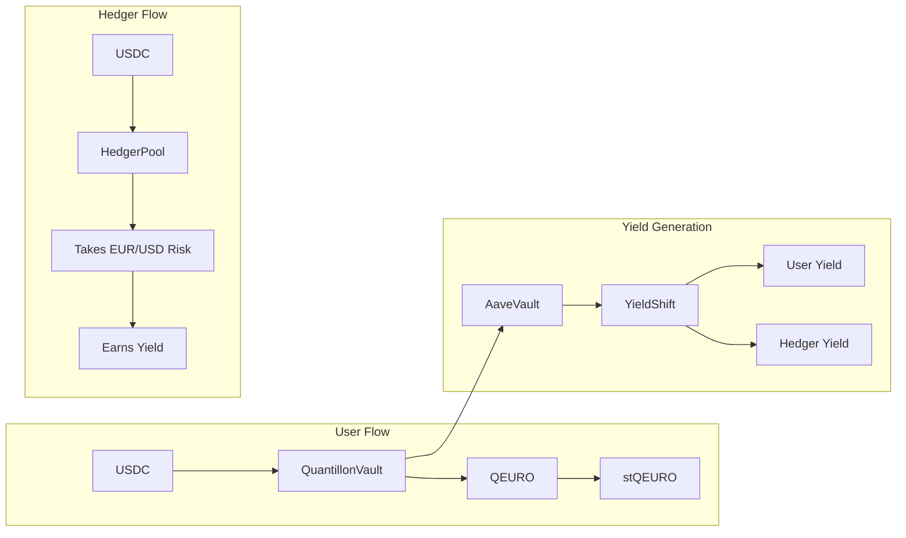
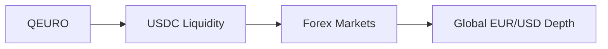

# TL;DR - Quantillon in 5 Minutes

> **One-liner:** Quantillon is a DeFi protocol that lets you hold euros on-chain, backed by USDC, with built-in FX hedging and yield generation.

---

## The 30-Second Version

- **QEURO** = Euro stablecoin backed by USDC (101%+ collateralized)
- **stQEURO** = Yield-bearing QEURO (think Lido's stETH, but for euros)
- **QTI** = Governance token (lock for veQTI = more voting power)
- **Two pools**: Users (mint QEURO) vs Hedgers (take FX risk for rewards)
- **Yield** comes from Aave + dynamic distribution via "YieldShift"

---

## How It Works

**The flow:**
1. **Users** deposit USDC into the Vault and receive QEURO at the current EUR/USD rate
2. **Hedgers** provide USDC and take on the EUR/USD currency risk
3. USDC collateral is deployed to **Aave** to generate yield
4. **YieldShift** dynamically splits yield between Users and Hedgers

---

## The Three Tokens

| Token | What It Is | Analogy | Key Feature |
|-------|-----------|---------|-------------|
| **QEURO** | Euro-pegged stablecoin | Like USDC, but for EUR | Always redeemable 1:1 |
| **stQEURO** | Yield-bearing QEURO wrapper | Like stETH | Value grows over time automatically |
| **QTI** | Governance token | Like veCRV | Lock tokens for more voting power |

### QEURO - The Euro Stablecoin
- Mint by depositing USDC
- Pegged to EUR via Chainlink oracles
- Overcollateralized (minimum 101%)
- Instant redemption back to USDC

### stQEURO - Auto-Compounding Yield
- Wrap your QEURO to earn yield automatically
- Exchange rate increases over time (no rebasing)
- Fully liquid and DeFi-composable
- Unwrap anytime to get more QEURO than you deposited

### QTI - Governance Power
- Vote on protocol parameters and upgrades
- Lock QTI to get veQTI (vote-escrowed QTI)
- Longer lock = more voting power (up to 4x multiplier)
- Fixed supply: 100 million tokens

---

## Key Numbers at a Glance

| Parameter | Value | What It Means |
|-----------|-------|---------------|
| **Min Collateralization** | 101% | Protocol is always overcollateralized |
| **Minting Fee** | 0.1% | Cost to mint QEURO |
| **Redemption Fee** | 0.1% | Cost to redeem back to USDC |
| **Max QTI Lock** | 365 days | Maximum lock for 4x voting power |
| **Min QTI Lock** | 7 days | Minimum lock period |
| **Yield Holding Period** | 7 days | Wait time before claiming yield (anti-flash loan) |
| **Oracle Staleness** | 1 hour | Max age for price feeds |
| **QEURO Max Supply** | 1 billion | Maximum mintable QEURO |
| **QTI Total Supply** | 100 million | Fixed, non-inflationary |

---

## The Dual-Pool Model

Quantillon separates participants into two roles:

### Users
- **Goal:** Hold stable EUR exposure + earn yield
- **Action:** Deposit USDC → Mint QEURO → Optionally stake for stQEURO
- **Risk:** Minimal - they get euro stability

### Hedgers
- **Goal:** Earn yield by taking FX risk
- **Action:** Provide USDC margin → Take EUR/USD positions
- **Risk:** Currency fluctuations (EUR/USD moves)
- **Reward:** Higher yield allocation when hedger supply is low

**Why it works:** Hedgers absorb EUR/USD volatility so Users get stable euro exposure. It's a win-win: Users get stability, Hedgers get compensated for risk.

---

## YieldShift - The Self-Balancing Mechanism

> "When there are many hedgers, users get more yield. When hedgers are scarce, they get more rewards to attract them."

**How it works:**
- Protocol tracks the ratio of User deposits vs Hedger liquidity
- Uses a 24-hour TWAP (time-weighted average) to prevent manipulation
- Dynamically adjusts yield split to maintain healthy balance
- **7-day holding period** prevents flash deposit attacks

**Result:** The protocol automatically incentivizes whatever role is currently needed most.

---

## Security Highlights

| Feature | Description |
|---------|-------------|
| **Chainlink Oracles** | EUR/USD and USDC/USD price feeds with staleness checks |
| **Circuit Breakers** | Automatic pause on abnormal price movements (>5% deviation) |
| **Rate Limiting** | Prevents excessive minting/burning in short periods |
| **Minting Killswitch** | Emergency stop for all minting operations |
| **Pausable Contracts** | All core contracts can be paused in emergencies |
| **UUPS Upgrades** | Upgradeable contracts with timelock protection |
| **Role-Based Access** | Granular permissions (Minter, Burner, Pauser, etc.) |
| **Blacklist/Whitelist** | Compliance controls for regulatory requirements |

---

## The Four Pillars of Quantillon

What makes Quantillon fundamentally different from other Euro stablecoins:

### 1. Liquidity by Design

> **Problem:** Most Euro stablecoins struggle with liquidity - you can't trade large amounts without massive slippage.

**Quantillon's solution:** Instead of building liquidity from scratch, we inherit it.

- **USDC backbone** - Tap into the deepest stablecoin liquidity in DeFi
- **Forex markets** - Access $7+ trillion daily EUR/USD trading volume
- **No cold start problem** - Day-one liquidity without years of bootstrapping
- **Low slippage** - Trade any size without moving the market

### 2. Holistic Protocol

> **Problem:** Existing Euro stablecoins are just tokens - no yield, no governance, no ecosystem.

**Quantillon's solution:** A complete three-token ecosystem where everything works together.

| Token | Role | Synergy |
|-------|------|---------|
| **QEURO** | Stable value | Foundation for stQEURO and protocol TVL |
| **stQEURO** | Yield generation | Drives QEURO demand and staking |
| **QTI** | Governance | Aligns incentives and controls parameters |

**The flywheel effect:**
- More QEURO minted → More yield generated → Higher stQEURO returns
- Higher returns → More users → More QEURO demand
- More users → More governance value → Higher QTI utility

### 3. Hedging Engine

> **Problem:** Holding EUR exposure with USD collateral creates currency risk. Who absorbs it?

**Quantillon's solution:** A native, protocol-level hedging mechanism.

- **Dedicated Hedger role** - Professional risk-takers who earn for their service
- **Delta-neutral positions** - Hedgers can be market-neutral if desired
- **Dynamic compensation** - YieldShift adjusts rewards based on hedger supply
- **Transparent P&L** - All positions and profits/losses tracked on-chain

**How it protects users:**
1. User deposits USDC, gets QEURO at EUR rate
2. Hedger takes the opposite side of EUR/USD exposure
3. If EUR moves, Hedger absorbs the difference
4. User always gets stable EUR value back

### 4. Modular Vaults

> **Problem:** One-size-fits-all collateral strategies don't work for everyone.

**Quantillon's solution:** Multiple vault backends for different risk/yield profiles.

| Vault | Strategy | Risk | Best For |
|-------|----------|------|----------|
| **aQEURO** | Aave lending | Low | Default choice, most users |
| **mQEURO** | MakerDAO | Medium | Conservative DeFi users |
| **bQEURO** | T-Bills/RWAs | Low | Institutional clients |
| **eQEURO** | Yield strategies | Higher | Risk-tolerant users |

**Benefits:**
- **Choose your risk** - Conservative or aggressive, your choice
- **Diversification** - Spread across multiple strategies
- **Upgradeable** - New vaults can be added via governance
- **Same QEURO** - All vaults mint the same fungible token

> **Note:** Currently, aQEURO (Aave) is the only implemented vault. Other variants are on the roadmap.

---

## How Quantillon Compares

| Feature | Quantillon | EUROC | EURS | agEUR |
|---------|------------|-------|------|-------|
| **Liquidity Source** | USDC + Forex | Own pools | Own pools | Own pools |
| **Native Yield** | stQEURO | None | None | Variable |
| **FX Hedging** | Built-in | None | None | Algorithmic |
| **Governance** | DAO (QTI) | Centralized | Centralized | DAO |
| **Vault Options** | Multiple | Single | Single | Single |
| **MiCA Alignment** | Yes | Yes | Unclear | Evolving |

---

## Quick Links

Want to dive deeper? Here's where to go:

| Topic | Page |
|-------|------|
| Full Protocol Overview | [Overview](../README.md) |
| Why Quantillon Exists | [Whitepaper](whitepaper.md) |
| QEURO Token Details | [QEURO Token](../protocol/quantillon-protocols-tokens/qeuro-token.md) |
| stQEURO Mechanics | [stQEURO Token](../protocol/quantillon-protocols-tokens/stqeuro-token.md) |
| QTI Governance | [QTI Token](../protocol/quantillon-protocols-tokens/qti-token.md) |
| Core Mechanisms | [Mechanisms](../protocol/mechanisms.md) |
| How YieldShift Works | [YieldShift](../protocol/yield-shift.md) |
| Liquidation System | [Liquidation](../protocol/liquidation-system.md) |
| Frequently Asked Questions | [FAQ](../complementary-information/frequently-asked-questions.md) |
| Glossary of Terms | [Glossary](../complementary-information/glossary.md) |

---

## TL;DR of the TL;DR

1. **Deposit USDC** → Get QEURO (euro stablecoin)
2. **Wrap QEURO** → Get stQEURO (earn yield automatically)
3. **Hold QTI** → Vote on protocol decisions
4. **Hedgers** take FX risk so you don't have to
5. **Yield** comes from Aave, split dynamically via YieldShift

**That's it. You now understand Quantillon Protocol.**

---

*Ready to get started? Visit the [dApp](https://app.quantillon.money/) to mint your first QEURO.*
