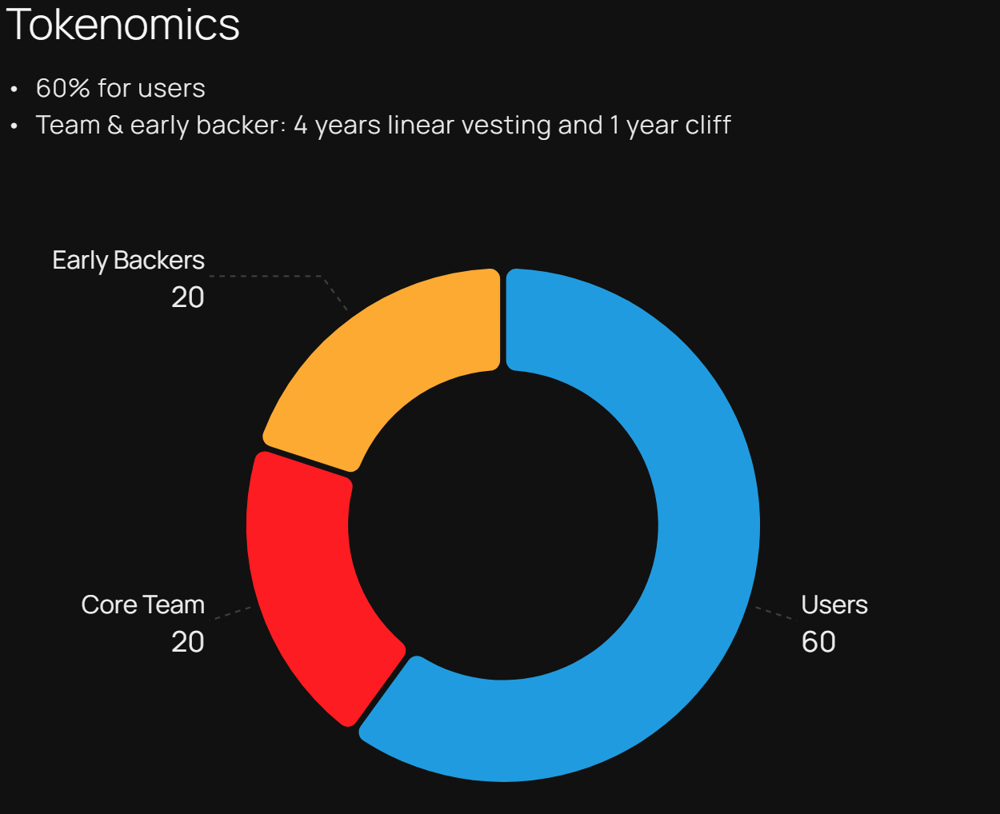

# QTI Token

## 🎨 Design and Inflation 

QTI's total initial supply is 1 billion and there is no planned token inflation.

The only address with minting capability is the Quantillon Governor Multisig.

## 🧬 Tokenomics 

The QTI token is the backbone of the Quantillon Protocol allowing it to be governed in a fully decentralized way.

The vision for the QTI distribution was that it needed to be multi-year, extended, and sustainable until the protocol reaches ubiquity. With this in mind, the token distribution is broken down as follows:

<figure><figcaption>
QTI Distribution
</figcaption></figure>

### 🪐 Liquidity Mining 

60% of tokens are being distributed for Quantillon stablecoins holders via liquidity mining.

### Quantillon Labs team and early backers 

These tokens are subject to a **linear vesting of 4 years**

* 20% to Quantillon Labs team members
* 20% to early backers

With this vesting schedule, liquidity distributed through liquidity mining to the Community is guaranteed to be bigger than that going to team and early backers.
